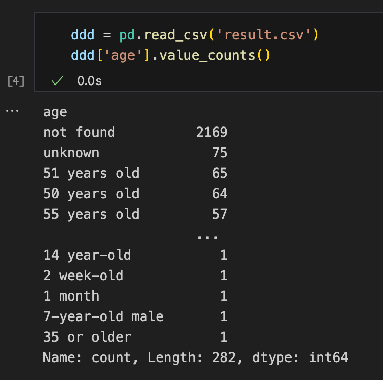
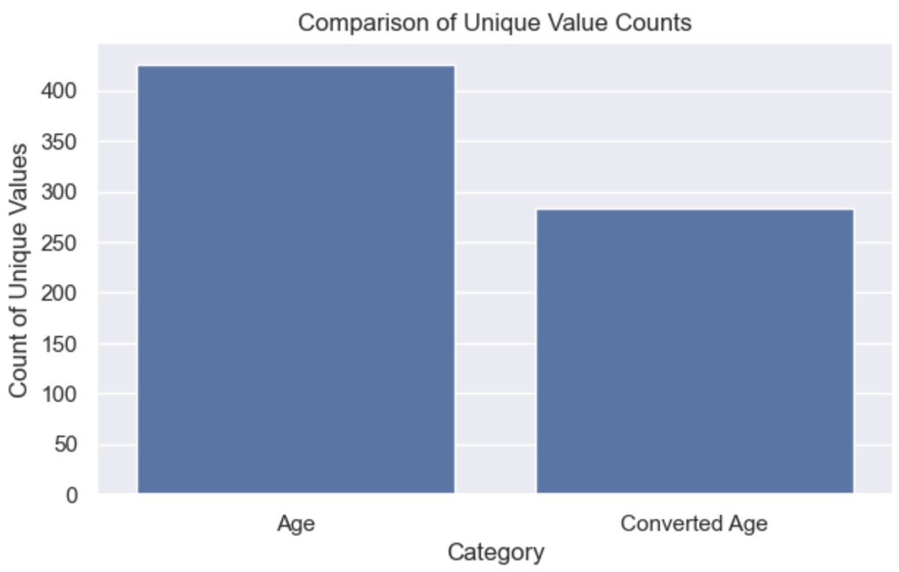

# Medical-Info-Extraction

>Note: The final extracted result is `result.csv`

### Data
* `description`: Short description of transcription
* `medical_specialty`: Medical specialty classification of transcription
* `sample_name`: Transcription title
* `transcription`: Sample medical transcriptions
* `keywords`: Relevant keywords from transcription

### Goals
* Extract the `age` of each patient
* Extract the `treatment` of each patient

### Solution
Leverage LLMs to systematically extract patients information, employing various prompt engineering techniques to enhance accuracy and reliability.

### Pipeline
* Step 1: Libraries
* Step 2: Configuration
* Step 3: Load Data & EDA
* Step 4: Model
* Step 5: Inference
* Step 6: Data Cleansing & Save Result
* Step 7: Data Visualization

### Data Cleansing
>Utilize Large Language Models (LLMs) and Q-lora for executing extensive-parameter models, methodically extracting patient information with advanced prompt engineering to optimize accuracy and reliability.

* Correct format (what we expect most)
    - `22-year-old`
    - `22 years old`
    - `22-month-old`
    - `22 months old`
    - `22-week-old`
    - `22 weeks old`
    - `22-day-old`
    - `22 days old`
    - `one plus-month-old`
    - `neonatal`
    - `new born`
    - `middle-aged`
    - `toddler`

* Extra suffix: remove the words after 'old' 
    - `9-year-old young lady`
    - `61-year-old female`
    - `61-year-old male` 
    - `12-day-old infant`
    - `69-year-old Caucasian male`

* Missing 'old': add 'old' after that
    - `16 years`                    
    - `39 and 1/7th weeks`
    - `7 months`
    - `1 month`

* Other way: return '26 years old'
    - `26y/oRHF`
    - `76 y/o`                      
    - `25y/o`
    - `80 yrs`
    - `55 yo`
    - `2 year(s)`
    - `25y`
    - `26 years oldRHF`

* Wrong information: return `not found`
    - `5 feet tall and currently weighs 110 pounds`
    - `unknown The patient will get Repeat exam in five years if adenomatous`
    - `600 grams`
    - `missing`
    - `1812g`
    - `1812 g`
    - `80 The patient will get IV antibiotics`

* unknown, just number or including `X` `*`: return `unknown`
    - `** week gestational age`
    - `XX-year-old`
    - `1+`
    - `almost 4`
    - `six`
    - `2-1/2`
    - `14-1/2`
    - `60`
    - `11-1/2`
    - `4-1/2`

There are 2169 `not found` and 75 `unknown`.
<center>
</img>
</center>

The unique value count of before and after data cleaning.
<center>
</img>
</center>


### Model Selection

|               Model                | Performance |   Comment  |
| :--------------------------------: | :---------: | :--------: |
|         Geogle/gemini-pro          |   Descent   |   Good Extraction, if the description don't have the exact treatment, return not found     |
|     Anthropic/Claude-3-sonnet      |   Creative    |   Good Extraction, if the description don't have the exact treatment, it will give some advice based on the given illness      |
|         THUDM/chatglm3-6b          |  Unstable   |  Sometimes got good extraction, sometimes not    |
| mistralai/Mistral-7B-Instruct-v0.1 |  Unstable   |  Sometimes got good extraction, sometimes not    |
|            openai/GPT2             |     Bad     |      -      |
|       bigscience/bloomz-7b1        |     Bad     |      -      |
|       microsoft/BioGPT-Large       |     Bad     |      -      |

### The Top 2 prompt

```python
# Top 1
prompt = f"""This is a patient's transcription: '{transcription}'
    Please use this format as the answer: The patient age is [Your extracted answer]. The patient will get [Your extracted answer] as treatment. 
    Note: If the treatment has already been administered, it's also considered as the treatment, the format will be revised slightly: The patient got [Your extracted answer] as treatment. 
    If there is no specific neither age or treatment , you can return not found, not found. 
    If there is no specific age but treatment, you can return not found, The patient will get [Your extracted answer] as treatment. 
    There may be not only one treatment"""

# Top 2
prompt = f"""This is a patient's transcription: '{transcription}'
    For the given patient's transcription, do the next actions sequentially:
    First, propose the patient's age. If there is no words about age, return unknown.
    Second, propose no more than ten words that summarize the treatment. If you don't know the treatment, assume '''unknown'''
    Note: don't use any other words.
    Then, show your response following the next format:
    Age: <age>
    Treatment: The patient will get <treatment> as treatment.
    """
```


### Challenge and Improvement
1. The trade-off between the originality and further understanding according to the given state of illness.

2. Data Cleansing, need to use LLMs to deep data cleansing to get the better formatted data.
